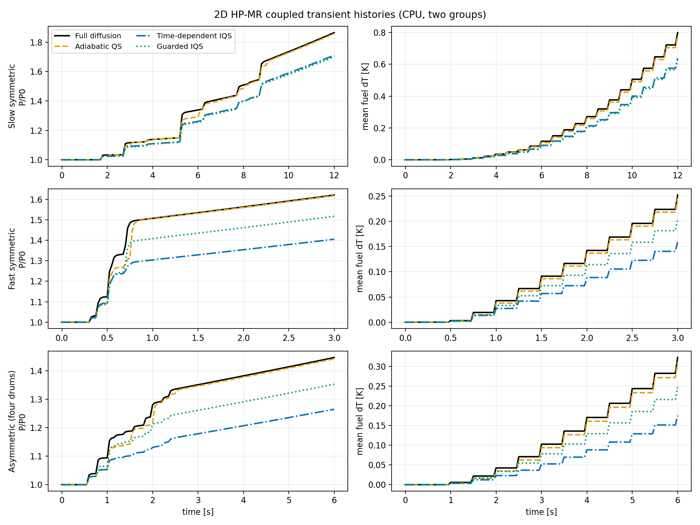
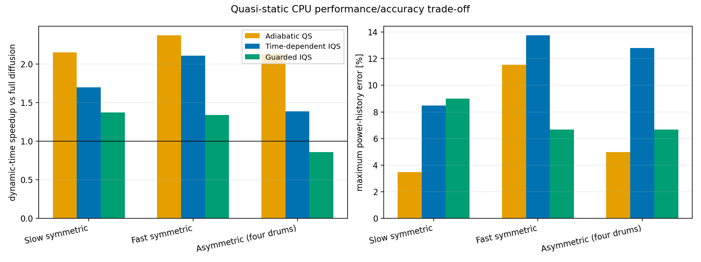

# 2D HP-MR quasi-static CPU benchmark

Run on 11 August 2026 against solver commit `0626045` using an Intel Core
i5-1145G7 (4 cores / 8 threads), Python 3.13.5, NumPy 2.1.3, and the CPU
backend. The complete benchmark took 86.4 seconds.

## Executive result

Adiabatic quasi-static treatment is presently the best speed/accuracy choice
on these cases. It reduced dynamic time by 2.1–2.4x. Its peak-power bias stayed
below 0.4%, although discrete macro updates caused maximum in-history errors of
3.5%, 11.5%, and 5.0% for the slow, fast, and asymmetric ramps.

The new time-dependent IQS corrector is not yet production-ready. It resolved
the final spatial shape very well—roughly 10–100x better than adiabatic QS—but
underpredicted power by 8–14%. This combination strongly suggests that the
remaining error is in amplitude/precursor coupling or macro-time integration,
not in the final spatial shape.

Residual guarding behaved as designed. A 0.012 soft threshold caused early
shape corrections. A 0.020 hard threshold invoked one full-diffusion interval
in both the fast symmetric and asymmetric cases, reducing their maximum power
errors from 13.7% to 6.7% and from 12.8% to 6.7%, respectively. The asymmetric
guarded run became 14% slower than full diffusion, demonstrating that fallback
is a safety mechanism rather than a guaranteed acceleration.





## Cases

All cases use the real 55-site 2D HP-MR geometry, polar area-fraction control
drums, 2,970 active triangular cells, delayed-neutron kinetics, conduction, and
Doppler feedback. Each has 120 fine neutron steps and 12 scheduled shape macro
intervals.

| Case | Drum motion | Static worth | Timing | Fine / thermal / shape dt |
|---|---|---:|---|---|
| Slow symmetric | all 12, 90° → 95° | +204.7 pcm (+0.315 $) | ramp 1–9 s; end 12 s | 0.10 / 0.50 / 1.00 s |
| Fast symmetric | all 12, 90° → 95° | +204.7 pcm (+0.315 $) | ramp 0.25–0.75 s; end 3 s | 0.025 / 0.25 / 0.25 s |
| Asymmetric | four adjacent +x drums, 90° → 110° | +145.7 pcm (+0.224 $) | ramp 0.5–2.5 s; end 6 s | 0.05 / 0.50 / 0.50 s |

The slow ramp uses 17 cached geometry frames; the other two use 11. The same
frame objects are reused between control changes, so operator rebuild identity
semantics match the intended coupled application.

## Performance

“Dynamic” time excludes the coupled steady-state solve but includes IQS
initialization and adjoint work. It is the fairest end-to-end comparison after
the common equilibrium calculation.

| Case | Method | Dynamic time [s] | Speedup | Shape updates | Fallbacks |
|---|---|---:|---:|---:|---:|
| Slow | Full diffusion | 5.99 | 1.00x | 0 | 0 |
|  | Adiabatic QS | 2.79 | 2.15x | 12 | 0 |
|  | Time-dependent IQS | 3.53 | 1.70x | 12 | 0 |
|  | Guarded IQS | 4.37 | 1.37x | 17 | 0 |
| Fast | Full diffusion | 6.29 | 1.00x | 0 | 0 |
|  | Adiabatic QS | 2.65 | 2.37x | 12 | 0 |
|  | Time-dependent IQS | 2.98 | 2.11x | 12 | 0 |
|  | Guarded IQS | 4.70 | 1.34x | 17 | 1 |
| Asymmetric | Full diffusion | 12.98 | 1.00x | 0 | 0 |
|  | Adiabatic QS | 6.09 | 2.13x | 12 | 0 |
|  | Time-dependent IQS | 9.37 | 1.39x | 12 | 0 |
|  | Guarded IQS | 15.15 | 0.86x | 18 | 1 |

The asymmetric full solve costs about twice the symmetric solve despite the
same mesh and step count, because the tilted spatial source needs substantially
more fixed-point/Krylov work. This is exactly the kind of workload where
shape acceleration should eventually pay off.

## Accuracy against full transient diffusion

The power metric is the maximum pointwise relative error over the entire
history. Peak bias compares the maximum power reached. Shape error is the L2
difference between final multigroup fluxes after unit-L2 normalization over
active cells.

| Case | Method | Max power error | Peak bias | Max mean-T error [K] | Final flux-shape L2 error |
|---|---|---:|---:|---:|---:|
| Slow | Adiabatic QS | 3.48% | -0.38% | 0.018 | 3.42e-4 |
|  | Time-dependent IQS | 8.48% | -8.28% | 0.161 | 1.26e-5 |
|  | Guarded IQS | 9.01% | -8.85% | 0.172 | 1.26e-5 |
| Fast | Adiabatic QS | 11.53% | -0.17% | 0.006 | 5.14e-4 |
|  | Time-dependent IQS | 13.75% | -13.32% | 0.093 | 5.22e-6 |
|  | Guarded IQS | 6.67% | -6.41% | 0.047 | 4.41e-6 |
| Asymmetric | Adiabatic QS | 4.99% | -0.32% | 0.011 | 4.93e-3 |
|  | Time-dependent IQS | 12.80% | -12.56% | 0.148 | 4.28e-5 |
|  | Guarded IQS | 6.68% | -6.48% | 0.075 | 7.88e-6 |

The adiabatic peak agrees much better than its maximum history error because
it catches up at the scheduled eigen-shape updates. Conversely, IQS follows an
excellent final spatial shape while carrying a biased amplitude. The current
projected spatial residual therefore cannot, by itself, guarantee amplitude
accuracy: the slow guarded case performs five extra corrections but does not
improve its power error.

Temperature differences are small because these 3–12 s runs are much shorter
than the approximately 268 s fuel thermal time constant. They validate the
coupling path but do not replace a minute-scale feedback benchmark.

## Recommended next implementation work

1. Promote IQS predictor/amplitude disagreement from telemetry to a second
   guard. The spatial residual did not detect the slow-ramp amplitude drift.
2. Integrate the actual cached operator frames inside each IQS macro interval.
   The present corrector uses a single backward-Euler step from the interval's
   start operator to its end operator, discarding the path and its timing.
3. Audit the projection of spatial precursor inventory back into effective
   point precursors. The excellent final shape alongside a large amplitude
   bias makes precursor/amplitude normalization a prime suspect.
4. Add macro-step convergence sweeps (`shape_dt`, corrector substeps, and drum
   frame cadence) before selecting production defaults.
5. Repeat first with 11 groups on GPU, then with the one-minute 3D case, only
   after the CPU amplitude discrepancy is resolved.

## Reproduction and raw data

From the repository root:

```bash
PYTHONPATH=. python examples/hpmr_quasistatic_benchmark.py \
  --refine 3 --output-dir benchmark-results/hpmr-quasistatic-cpu
```

- [`summary.csv`](summary.csv): one row per case and method, including timings,
  errors, solver work, residuals, and fallback counts.
- [`histories.csv`](histories.csv): power and temperature histories.
- [`metadata.json`](metadata.json): machine-independent case definitions and
  measured cold-static worths.
- [`histories.png`](histories.png) and [`tradeoffs.png`](tradeoffs.png): figures
  used above.

The benchmark uses the repository's illustrative two-group HP-MR material set.
It is suitable for algorithm comparison but not for predictive reactor-safety
claims. The 11-group ENDF/B-VIII-derived set is available through `--groups 11`
but was deliberately not used for this CPU matrix.
